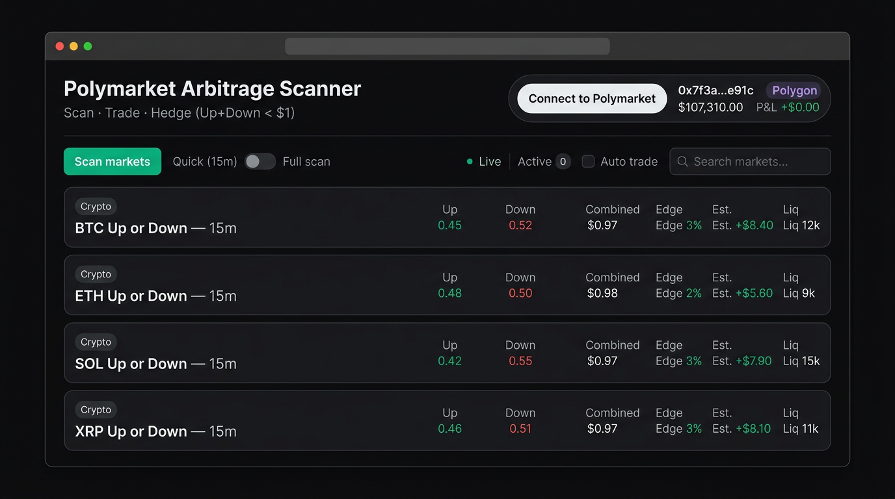
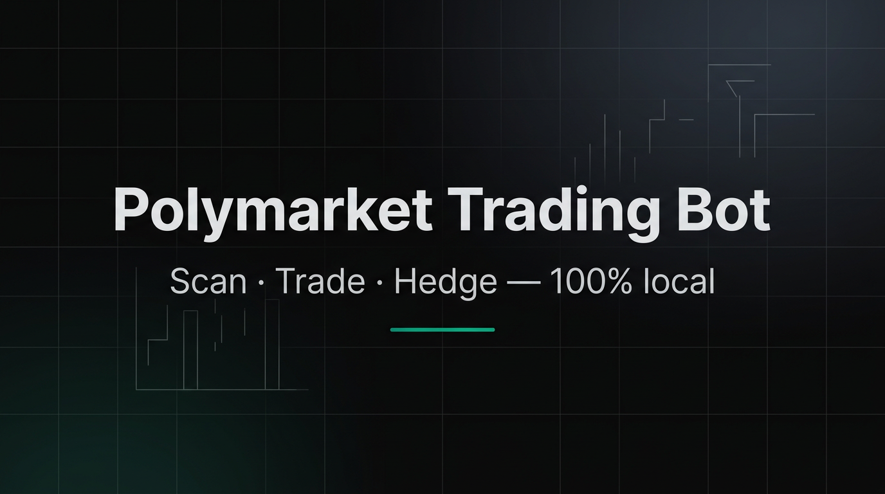

# 🤖 Polymarket Trading Bot

<p align="center">
  
</p>
<p align="center">
  <sub><strong>Our interface</strong> — local dashboard (Connect · Scan · Auto trade · Active · PnL)</sub>
</p>

<p align="center">
  
</p>

**Automated arbitrage bot for Polymarket** — scans 15-minute Up/Down crypto markets, finds combined price &lt; $1, and places hedged orders. All logic and your keys stay on your machine; a local web dashboard gives full control.

[](https://www.python.org/downloads/)
[](https://www.python.org/)
[](LICENSE)

---

## Table of contents

- [What it does](#what-it-does)
- [How it works](#how-it-works)
- [Architecture](#architecture)
- [Screenshot](#screenshot)
- [Prerequisites](#prerequisites)
- [Installation](#installation)
- [Configuration](#configuration)
- [How to run](#how-to-run)
- [Using the dashboard](#using-the-dashboard)
- [Configuration reference](#configuration-reference)
- [Local API](#local-api)
- [Security & trust](#security--trust)
- [FAQ](#faq)
- [Project structure](#project-structure)
- [Troubleshooting](#troubleshooting)
- [Disclaimer](#disclaimer)
- [License](#license)

---

## What it does

| Feature | Description |
|--------|-------------|
| **Market scan** | Fetches 15m Up/Down markets (BTC, ETH, SOL, XRP) from Polymarket CLOB and aggregates order books. |
| **Arbitrage filter** | Keeps only setups where **Up + Down &lt; $1** (configurable threshold), with liquidity and spread filters. |
| **Risk controls** | Position sizing (Kelly fraction), max per position, circuit breaker on session loss, cooldown between trades. |
| **Execution** | Places hedged orders (buy both outcomes) with configurable slippage; optional auto-trade from the UI. |
| **Dashboard** | Local web UI: connect wallet, run scan, view opportunities, active positions, PnL, and metrics. |

No cloud account or third-party API keys required. The bot and UI run entirely on your computer; only Polymarket (CLOB + Polygon) are used for data and trading.

---

## How it works

1. **Load wallet** — Reads `wallet.txt` (private key or mnemonic). Derives address and uses it for balance checks and order signing.
2. **Connect** — Uses Polymarket CLOB API and Polygon RPC (configurable). Rate-limited requests to avoid bans.
3. **Scan** — For each 15m market, fetches order book, computes best bid/ask for Yes and No, and checks:
   - Combined ask (Yes ask + No ask) &lt; `max_combined_for_arb` (default 0.99).
   - Edge % within `min_edge_pct`–`max_edge_pct`.
   - Liquidity ≥ `min_liquidity_usd`, spread within limits, cross-market correlation sanity.
4. **Validate** — Each opportunity is validated (no NaN, bounds, spread &lt; 500 bps) before it can be traded.
5. **Size & execute** — Position size uses Kelly fraction and configurable caps. Hedge = buy half Yes + half No; orders are signed and sent to the CLOB.
6. **Risk** — Circuit breaker stops new trades if session loss exceeds `circuit_breaker_loss_usd`; cooldown and per-market limits apply.

---

## Architecture

```
┌─────────────────────────────────────────────────────────────────┐
│  Your machine                                                    │
│  ┌──────────────┐     ┌─────────────────────────────────────┐  │
│  │  wallet.txt  │────▶│  polymarketAI.py                     │  │
│  │  (key only)  │     │  · Config (env + config.json)         │  │
│  └──────────────┘     │  · PolymarketClient (CLOB + Polygon)  │  │
│                       │  · Scanner (15m markets, filters)      │  │
│                       │  · RiskManager (circuit breaker, etc.) │  │
│                       │  · OrderManager (place/cancel)        │  │
│                       │  · HTTP server (static + /api/*)      │  │
│                       └─────────────────┬─────────────────────┘  │
│                                         │                        │
│  ┌─────────────────────────────────────▼─────────────────────┐ │
│  │  Browser — http://localhost:8765                            │ │
│  │  index.html  · Connect · Scan · Auto trade · Active · PnL     │ │
│  └─────────────────────────────────────────────────────────────┘ │
└─────────────────────────────────────────────────────────────────┘
                                    │
                                    ▼
              Polymarket CLOB API   │   Polygon RPC
              (order books, orders) │   (balance, chain)
```

- **Stack:** Python 3.8+ (stdlib only: `http.server`, `json`, `threading`, etc.), frontend: vanilla HTML/CSS/JS.
- **Data flow:** Dashboard calls `/api/status`, `/api/scan`, `/api/config`, etc. Bot talks to Polymarket and Polygon; keys never leave the process.

---

## Screenshot

The image at the top of this README is the **dashboard** (our bot’s interface). To add or update it:

1. Run the bot: `python polymarketAI.py`
2. Open the dashboard in your browser: **http://localhost:8765**
3. Take a screenshot of the page (e.g. Win+Shift+S or your browser’s capture tool)
4. Save it as **`screenshot.png`** in this project folder (same folder as `README.md`)

The README will then show your dashboard at the top.

---

## Prerequisites

- **Python 3.8+** — [python.org](https://www.python.org/downloads/) (on Windows, e.g. use the official installer and check **“Add Python to PATH”**).
- **Polymarket wallet** — Private key or 12/24-word mnemonic; you will store it in `wallet.txt` (see [Configuration](#configuration)).

---

## Installation

1. **Download** the repository (clone or **Code → Download ZIP**).
2. **Unzip** into a folder (e.g. `Desktop` or `Documents`).
3. Ensure these files are in the **same directory**:
   - `polymarketAI.py` — main bot and local server
   - `index.html` — dashboard UI
   - `wallet.txt` — wallet configuration (edit before first run)

---

## Configuration

### Wallet (`wallet.txt`)

Open `wallet.txt` and set **either**:

- `private_key = <your_hex_key>` (with or without `0x`), or  
- `mnemonic = word1 word2 ... word12` (or 24)

Lines starting with `#` are ignored. Save the file and **never share or commit it** — it controls your funds.

### Optional: `config.json` and environment variables

You can override defaults by creating a `config.json` in the same folder or by setting environment variables. See [Configuration reference](#configuration-reference) for all keys.

Example `config.json`:

```json
{
  "max_position_usd": 300,
  "min_edge_pct": 1.0,
  "scan_interval_sec": 20,
  "min_liquidity_usd": 2000
}
```

---

## How to run

**Option A — Python from folder**

- Open the folder containing `polymarketAI.py`.
- Right‑click **`polymarketAI.py`** → **Open with** → **Python** (or double‑click if associated).  
- A console window will open; the dashboard will open in your browser at `http://localhost:8765`.

**Option B — Terminal / PowerShell**

- Open the folder in File Explorer, then **Shift + right‑click** → **“Open PowerShell window here”** (or “Open in Terminal”).
- Run:
  ```bash
  python polymarketAI.py
  ```
- Open the URL shown (e.g. `http://localhost:8765`) if the browser does not open automatically.

Keep the console window open while using the bot. Close it or press **Ctrl+C** to stop.

---

## Using the dashboard

| Action | Description |
|--------|-------------|
| **Connect** | Click **“Connect to Polymarket”**. The bot uses `wallet.txt`; the UI shows address and USDC balance. |
| **Scan** | Click **“Scan markets”**. The bot scans 15m markets and displays opportunities (combined &lt; $1, edge %, liquidity). |
| **Filters** | Use **Min edge %** and **Max per position $** to limit which opportunities are shown and how much you risk per trade. |
| **Auto trade** | Enable **“Auto trade”** to let the bot place hedged positions automatically when it finds valid setups. |
| **Active** | Open **“Active”** to see open positions, unrealized and realized PnL. |

Some positions may close at a loss if the market moves before fill; the strategy and risk limits are designed to keep risk bounded.

---

## Configuration reference

| Parameter | Default | Description |
|----------|--------|-------------|
| `polygon_rpc` | `https://polygon-rpc.com` | Polygon RPC URL. |
| `chain_id` | `137` | Polygon mainnet. |
| `clob_api` | `https://clob.polymarket.com` | Polymarket CLOB base URL. |
| `gamma_api` | `https://gamma-api.polymarket.com` | Gamma API base URL. |
| `min_edge_pct` | `0.5` | Minimum edge % to consider (0.01–50). |
| `max_edge_pct` | `15.0` | Maximum edge % (filters unrealistic edges). |
| `max_position_usd` | `500` | Max position size in USD (10–100000). |
| `min_position_usd` | `10` | Min position size in USD. |
| `scan_interval_sec` | `15` | Seconds between scan cycles in background. |
| `order_timeout_sec` | `30` | Order timeout. |
| `max_retries` | `3` | HTTP retries for CLOB/Polygon. |
| `retry_backoff_sec` | `1.0` | Backoff between retries. |
| `rate_limit_calls_per_min` | `60` | Max API calls per minute. |
| `kelly_fraction` | `0.25` | Kelly fraction for position sizing (0.01–1). |
| `max_drawdown_pct` | `5.0` | Max drawdown % (risk metric). |
| `cooldown_after_trade_sec` | `10` | Cooldown before next trade on same market. |
| `min_liquidity_usd` | `1000` | Min liquidity (USD) to consider a market. |
| `max_combined_for_arb` | `0.99` | Max combined Yes+No price to treat as arb (e.g. 0.99 = &lt; $1). |
| `slippage_bps` | `50` | Slippage in basis points for orders. |
| `circuit_breaker_loss_usd` | `1000` | Session loss (USD) that triggers circuit breaker. |

You can set these in `config.json` or via environment variables (e.g. `MAX_POSITION_USD=300`).

---

## Local API

The bot serves the dashboard and a small REST API on **http://127.0.0.1:8765** (localhost only).

| Endpoint | Method | Description |
|----------|--------|-------------|
| `/` | GET | Serves `index.html`. |
| `/api/status` | GET | Wallet connected, address, balance, chain_id, session PnL, trades count. |
| `/api/scan` | GET | Runs a scan and returns `{ "opportunities": [...], "count": N }`. |
| `/api/config` | GET | Current config (keys/secrets excluded). |
| `/api/metrics` | GET | Counters and gauges (e.g. scan_cycles, balance_usd). |
| `/api/risk` | GET | Circuit breaker state, session loss. |

All responses are JSON. No authentication is used; the server binds to localhost only.

---

## Security & trust

- **Keys stay local** — Your private key or mnemonic is read only from `wallet.txt` on your machine. It is never sent to any server except as part of signing orders to Polymarket/Polygon.
- **No telemetry** — The bot does not phone home. No analytics or tracking.
- **Open source** — You can read `polymarketAI.py` and `index.html` to verify behavior.
- **Minimal dependencies** — Standard library only; no pip install required. Reduces supply-chain risk.
- **Circuit breaker** — Automatic stop of new trades after a configurable session loss to limit downside.

**Best practice:** Use a dedicated wallet with only the funds you are willing to risk for this strategy.

---

## FAQ

### Where is my private key / mnemonic stored?

Only in the file **`wallet.txt`** in the same folder as the bot, on **your computer**. The bot reads it when you run it and when you click “Connect” in the dashboard. It is not stored in any cloud, database, or external service.

### Does my key get sent anywhere? Does it leave my PC?

**No.** The key never leaves your machine in plain form. The only thing that ever goes over the network is **signed order data** when you place a trade — same as with any wallet (MetaMask, etc.): your key is used locally to create a signature, and only the signature is sent to Polymarket’s API. Polymarket (and Polygon) never receive your private key or mnemonic.

### Is everything really running locally on my PC?

**Yes.** The bot (`polymarketAI.py`) and the dashboard (`index.html`) run entirely on your computer:

- The **Python process** runs on your machine and only talks to:
  - **Polymarket CLOB API** — to fetch order books and send orders.
  - **Polygon RPC** — to read your balance (and for chain-related calls).
- The **dashboard** is served by the same Python process on **localhost** (e.g. `http://localhost:8765`). Your browser talks only to your own PC, not to any other server run by the bot author. No part of the bot runs on our servers or in the cloud.

### What data goes to the internet?

Only what’s needed for trading and reading public market data:

- **To Polymarket:** requests for markets and order books (public), and when you trade: order details + **cryptographic signature** (no key, only the signature).
- **To Polygon RPC:** balance and chain queries for your wallet address.

No wallet file contents, no keys, no mnemonics, and no usage/analytics are sent anywhere else.

### Does the bot collect analytics or send my data to the developer?

**No.** There is no telemetry, no analytics, and no “phone home.” The code does not send your keys, balances, or behavior to the author or any third party. You can confirm this by searching the repo for network calls; the only outbound connections are to the Polymarket and Polygon endpoints described above.

### Do I need to create an account or register somewhere to use the bot?

**No.** You don’t register with the bot or with us. You only need:

- A Polymarket-compatible wallet (your own private key or mnemonic in `wallet.txt`).
- Python on your PC to run the script.

No signup, no email, no account with the bot.

### Who can access my wallet while the bot is running?

Only the Python process on your computer. The built-in server listens on **127.0.0.1** (localhost) only, so the dashboard is reachable only from your machine. No one on the internet can open your dashboard or use your key unless they already have access to your PC.

### Is `wallet.txt` encrypted?

**No.** It’s a plain text file. You are responsible for protecting it: don’t share it, don’t commit it to Git, and keep your PC secure. For extra safety, use a wallet that holds only the funds you’re willing to use with this bot.

### Can I use the bot without putting my key in a file?

The current version reads the key only from `wallet.txt`. If you don’t want to use that file, you’d need to change the code (e.g. read from an environment variable or a hardware wallet integration). Out of the box, the key must be in `wallet.txt` for the bot to trade.

### Does the bot need an internet connection?

**Yes**, but only to talk to Polymarket and Polygon (to get order books, balances, and to submit orders). If you disconnect the internet, scanning and trading will stop; nothing is sent or run on our side.

### Summary: is it all local?

| What | Where it runs / lives |
|------|------------------------|
| Your key / mnemonic | Only in `wallet.txt` on your PC |
| Bot logic | Your PC (Python process) |
| Dashboard | Your PC (browser ↔ localhost) |
| Order book data | Fetched from Polymarket to your PC |
| Placing orders | Your PC signs → only signature sent to Polymarket |
| Analytics / telemetry | None — nothing sent to the developer or third parties |

---

## Project structure

```
polymarket_scanner/
├── polymarketAI.py   # Bot: config, wallet, CLOB client, scanner, risk, orders, HTTP server
├── index.html        # Dashboard UI (connect, scan, auto trade, active, PnL)
├── wallet.txt        # Wallet credentials — edit locally, never commit
├── config.json       # Optional: overrides for defaults (create if needed)
└── README.md         # This file
```

---

## Troubleshooting

| Issue | What to check |
|-------|----------------|
| **“Wallet file not found”** | Ensure `wallet.txt` exists in the same folder as `polymarketAI.py`. |
| **“No wallet in wallet.txt”** | Add a line `private_key = ...` or `mnemonic = ...` in `wallet.txt`. |
| **Address 0x7f3a…e91c / balance 107310** | In the demo, the UI may show a fixed address/balance until you connect with a real wallet. |
| **Port 8765 in use** | Stop any other process using 8765, or change `PORT` at the top of `polymarketAI.py`. |
| **Python not found** | Install Python and ensure it is on PATH; use `python polymarketAI.py` or `py polymarketAI.py` on Windows. |

---

## Disclaimer

This bot is for **educational and personal use** only. Trading on prediction markets involves financial risk. You are solely responsible for your use of the bot and any losses. The authors are not liable for any financial or other damages. Never share `wallet.txt` or commit it to a public repository.

---

## License

MIT (or your choice — update as needed.)

---

**James Dev** — Polymarket Trading Bot
